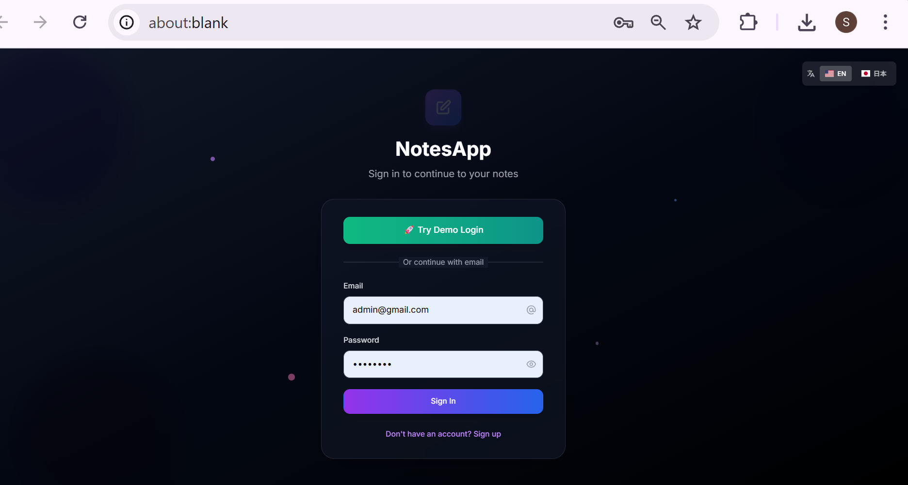
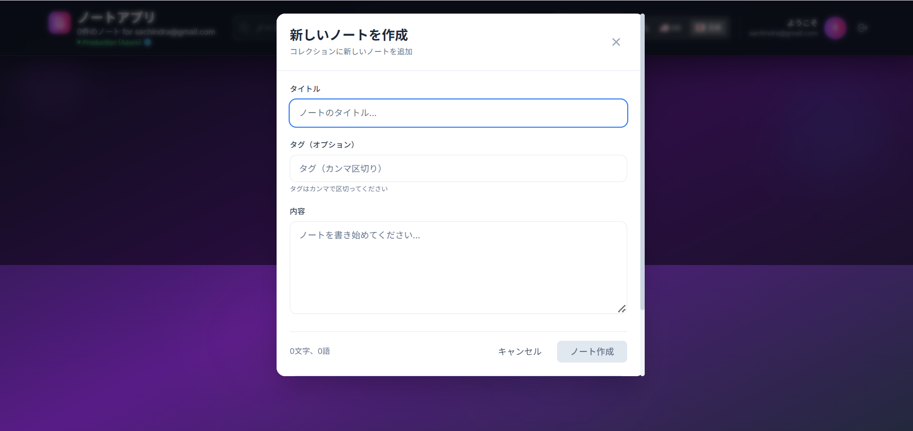

# Notes App (React + Vite)

## 🚀 Live Demo

[Open the app on Azure (Login/Register)](https://mynoteapp-ehahhgf7dhe8hufc.japanwest-01.azurewebsites.net/login)
# Notes App (React + Vite)


## Screenshots

<p align="center">
	<br><sub>Login Screen</sub><br><br>
	<br><sub>Register Screen</sub><br><br>
	<br><sub>Notes List</sub><br><br>
	<br><sub>Note Editor</sub><br><br>
	<br><sub>Mobile View</sub>
</p>

# Notes App (React + Vite)

>A full-stack notes application with authentication, offline support, and Azure deployment. Built with React, Vite, TailwindCSS, and Docker.

## Features
- User authentication (login/register/logout)
- Create, edit, and delete notes
- Offline support (localStorage cache)
- Responsive UI with TailwindCSS
- Service-context pattern for state management
- API integration with Azure backend
- Dockerized for easy deployment

## Getting Started

### Local Development
1. **Install dependencies:**
	```bash
	npm install
	```
2. **Start the dev server:**
	```bash
	npm run dev
	```
3. Open [http://localhost:5173](http://localhost:5173) in your browser.

### Build for Production
```bash
npm run build
```
The output will be in the `dist/` folder.

### Preview Production Build
```bash
npm run preview
```

## Docker Usage

### Build Docker Image
```bash
docker build -t sachindra785/mynotesapp:v1 .
```

### Run Locally with Docker
```bash
docker run -p 8080:80 sachindra785/mynotesapp:v1
```
Then visit [http://localhost:8080](http://localhost:8080)

### Push to Docker Hub
```bash
docker push sachindra785/mynotesapp:v1
```

## Azure Deployment

1. **Push Docker image to Docker Hub** (see above)
2. **Update Azure Web App to use the new image:**
	```bash
	az webapp config container set --name <app-name> --resource-group <resource-group> --docker-custom-image-name sachindra785/mynotesapp:v1
	az webapp restart --name <app-name> --resource-group <resource-group>
	```
3. **SPA Routing:**
	- The included `nginx.conf` ensures all routes serve `index.html` for React Router support.

## Environment & API
- All API calls use the Azure backend: `https://notesapps-b0bqb4degeekb6cn.japanwest-01.azurewebsites.net`
- No localhost or proxy logic in production.

## Troubleshooting
- **CORS errors:** Ensure your backend allows your frontend domain in CORS settings.
- **404 on direct route:** SPA routing is handled by nginx config in Docker.
- **Service worker/cache issues:** Clear browser cache and unregister service workers if you see old endpoints.

## Project Structure
- `src/` — React source code
- `public/` — Static assets
- `Dockerfile`, `nginx.conf` — Docker and nginx config

## License
MIT
